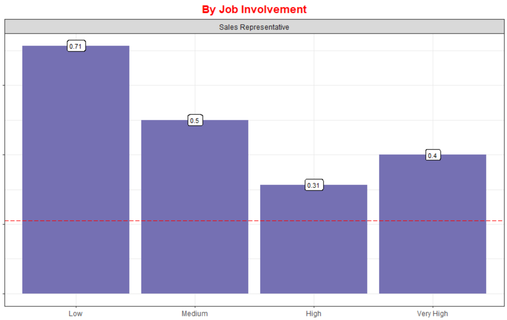
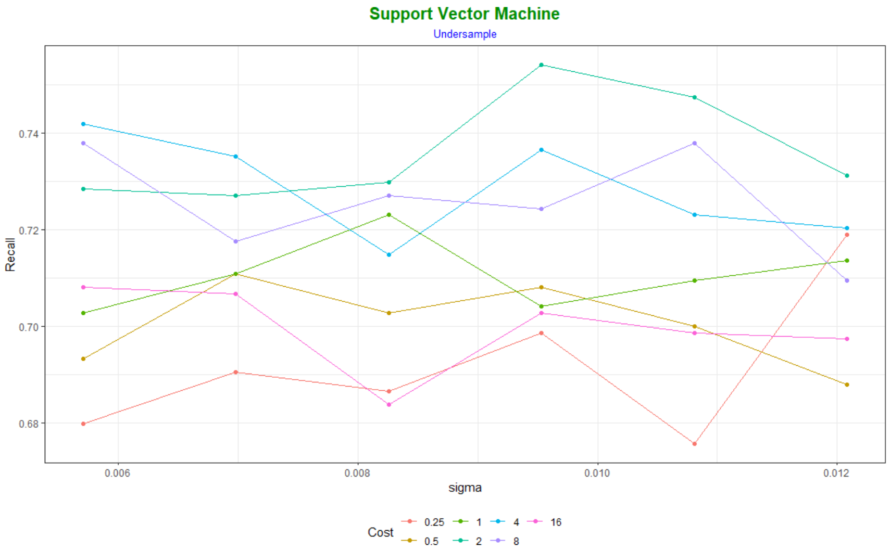
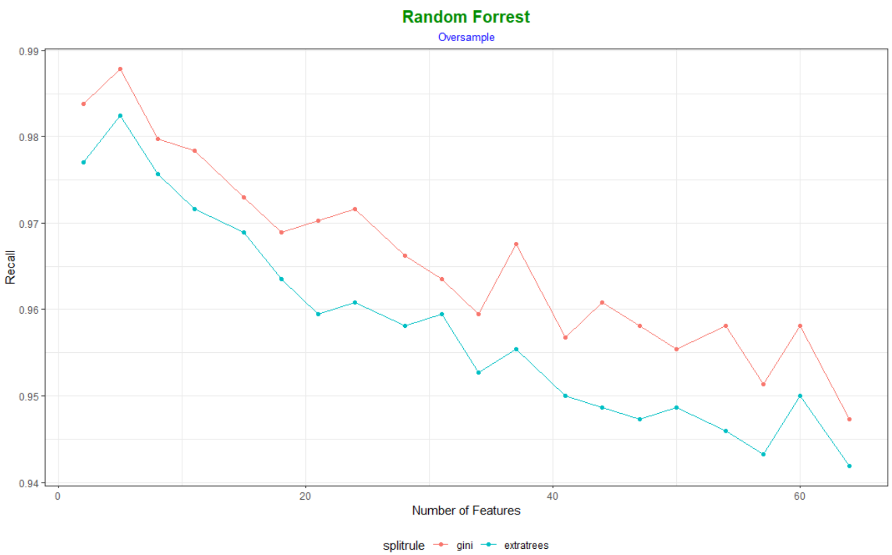
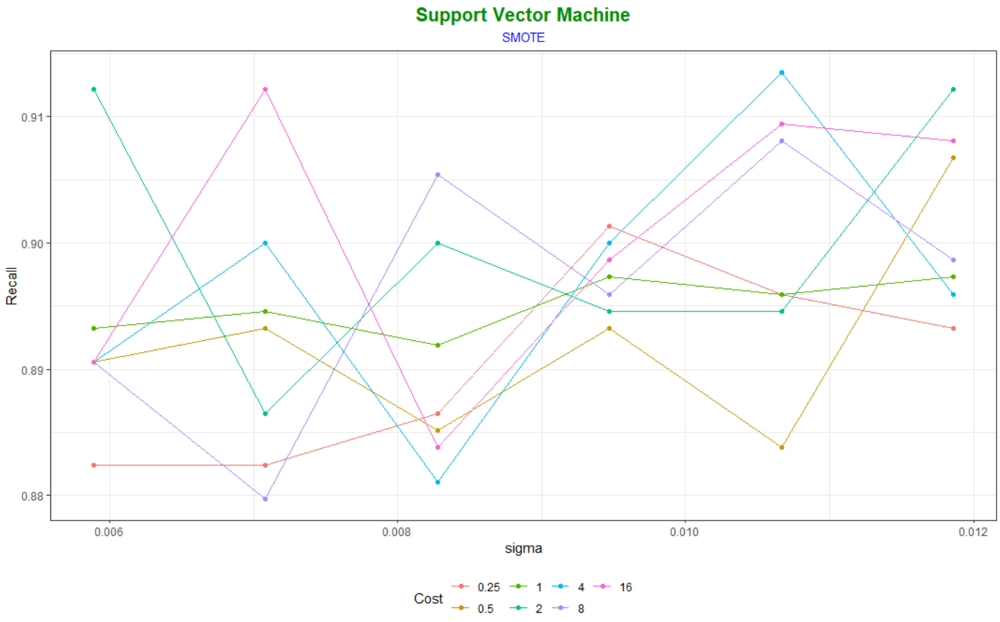

# Project Overview: Churn Prediction
This dataset is a fictional HR dataset created by IBM Data Scientists. There is not much backgroud information about where the data is sourced, what each data point means or how each variable is measured . However based on the data I infer that it may be a company related to the production and sales of Pharmaceuticals. For this project I will be analyzing the data to find drivers of churn and develop a model.

## Code Used
R | version
--- | ---
readr            | 1.4.0
dplyr            | 1.0.3
tidyr            | 1.1.2
ggplot           | 3.3.3
RColorBrewer     | 1.1-2
ggpubr           | 0.4.0
purrr            | 0.3.4
broom            | 0.7.3
caret            | 6.0-86
gbm              | 2.1.8
ranger           | 0.12.1
DMwR             | 0.4.1
InformationValue | 1.2.3
DALEX            | 2.0.1
modelplotr       | 1.1.0
doParallel       | 1.0.16

## Business Requirement
1. Find drivers of employee Churn for company A
2. Develop a model to predict Churn

## Data Collection
_The dataset did not come with predefined description. My idea of what each variable means is listed_

Feature | Description
--- | ---
Age                      | employee age
**Attrition "Churn"**    | Yes - Churn; No = Stayed
BusinessTravel           | Non Travel; Travel Rarely; Travel Frequently
DailyRate                | employee pay per day
Department               | Department employee works in
DistanceFromHome         | How far is work from their home
Education                | Below College; College; Bachelor; Master; Doctor
EducationField           | Human Resources; Life Sciences; Marketing; Medical; Technical Degree; Other
EmployeeCount            | employee count
EmployeeNumber           | employee ID
EnvironmentSatisfaction  | Low; Medium; High; Very High
Gender                   | Female; Male
HourlyRate               | employee pay per hour
JobInvolvement           | Low; Medium; High; Very High
JobLevel                 | 1; 2; 3; 4; 5
JobRole                  | Healthcare Representative; Human Resources; Laboratory Technician; Manager; Manufacturing Director; Research Director; Research Scientist; Sales Executive; Sales Representative
JobSatisfaction          | Low; Medium; High; Very High 
MaritalStatus            | Divorced; Married; Single
MonthlyIncome            | employee pay per Month
NumCompaniesWorked       | number of companies an employee has worked before
Over18                   | Y-Yes
OverTime                 | No; Yes
PercentSalaryHike        | increase in salary by percentage
PerformanceRating        | Low; Good; Excellent; Outstanding
RelationshipSatisfaction | Low; Medium; High; Very High
StandardHours            | standard hours per week or 2 weeks (not sure) 
StockOptionLevel         | 0; 1; 2; 3
TotalWorkingYears        | how long has a company been working
TrainingTimesLastYear    | how many times did an employee get trained last year
WorkLifeBalance          | Bad; Good; Better; Best
YearsAtCompany           | how many years has an employee been at the company
YearsInCurrentRole       | how many years has an employee been in their current role
YearsSinceLastPromotion  | how many years has it been since an employee receieved a promotion
YearsWithCurrManager     | how many years has an employee been with their current mamanger

# Exploratory Data Analysis

## DEPT: SALES

### Sales Representatives: 
#### Factors

  
   
  
  
  
  

#### Continous

# Modeling

## Preprocess
**Split**
* 60% - Training Set
* 20% - Validation Set
* 20% - Test Set

Used 10-Fold Cross Validation to find the best hyperparameters

**GOAL**: To catch a VERY HIGH % of the people that may Churn from the company and rank based on risk of churning. (Based on this the metric I choose to optimize is **Recall** becauses it focuses on predicting the Target Class “Churn” Correctly)

## BASELINE 
### Fit

Hyperparameter | value
--- | ---
Cost Complexity | 0.06

Hyperparameter | value
--- | ---
Num of Feats per Split | 2
Minimal Node Size      | 1
Splitrule              | gini

Hyperparameter | value
--- | ---
Num of Boosting Iterations | 50
Shrinkage | 0.3
Max Tree Depth      | 1
gamma    | 0
Subsample Ratio of Columns | 0.6
Minimum Sum of Instance Weight | 1
Subsample | 1

Hyperparameter | value
--- | ---
Cost | 16
Sigma | 0.006

Hyperparameter | value
--- | ---
alpha | 0.1
lambda | 0.11

### Diagnostic

Num | Model | Recall | | Num | Model | Recall
| --- | --- | --- | --- | --- | --- | ---
1 | Logistic Regression     | 53% |   | 1 | Decision Tree.16          | 100%
2 | SVM                     | 23% |   | 2 | Logistic Regression.16    | 77%
3 | XGB                     | 11% |   | 3 | SVM.13                    | 72%
4 | Regularized Regression  | 6%  |   | 4 | Regularized Regression.21 | 72%
5 | Random Forrest          | 4%  |   | 5 | XGB.21                    | 68%
6 | Decision Tree           | 0%  |   | 6 | Random Forrest.21         | 55%

* Best **_BASELINE_** Model: **Logistic Regression**
* Best **_BASELINE + Threshold_** Model: **Logistic Regression with cut off at 16%**. _Suspicious about the 100% Recall from Decision Tree plus the Precision was really poor compared to the other models_.

 
## UNDERSAMPLE 
**NOTE (Class Imbalance)**: 
Their are a number of different Techniques to potentially overcome Class Imbalance when modeling, such as changing the Hyperparameter and Threshold tunning like done previously. Other strategies are Cost Sensitive Algorithms or One-Class Algorithms.

The technique I’m going to used is called Resampling. Resampling is done by a number of ways;
* **Undersampling (Down Sampling)**: removing samples from the majority to match the minority.
* **Oversampling (Up Sampling)**: duplicating samples from the minority class to match the majority class.
* **Synthetic Minority Oversampling Technique (SMOTE)**: synthesize new examples from the minority class using k-nearest neighbors.

### Fit

Hyperparameter | value
--- | ---
Cost Complexity | 0.02

Hyperparameter | value
--- | ---
Num of Feats per Split | 41
Minimal Node Size      | 1
Splitrule              | extratrees

Hyperparameter | value
--- | ---
Num of Boosting Iterations | 50
Shrinkage | 0.4
Max Tree Depth      | 1
gamma    | 0
Subsample Ratio of Columns | 0.8
Minimum Sum of Instance Weight | 1
Subsample | 0.625

Hyperparameter | value
--- | ---
Cost | 2
Sigma | 0.009

Hyperparameter | value
--- | ---
alpha | 0.16
lambda | 0.01

### Diagnostic

Num | Model | Recall | | Num | Model | Recall
| --- | --- | --- | --- | --- | --- | ---
1 | Regularized Regression (DOWN)  | 79% |  | 1 | XGB.43 (DOWN)                     | 83%
2 | Logistic Regression (DOWN)     | 72% |  | 2 | SVM.46 (DOWN)                     | 77%
3 | Random Forrest (DOWN)          | 70% |  | 3 | Random Forrest.55 (DOWN)          | 70%
4 | XGB (DOWN)                     | 70% |  | 4 | Logistic Regression.79 (DOWN)     | 70%
5 | SVM (DOWN)                     | 68% |  | 5 | Regularized Regression.72 (DOWN)  | 66%
6 | Decision Tree (DOWN)           | 64% |  | 6 | Decision Tree.79 (DOWN)           | 62%

* Best **_UNDERSAMPLE_** Model: **Regularized Regression**
* Best **_UNDERSAMPLE + Threshold_** Model: **XGB with cut off at 43%**.

## OVERSAMPLE 
### Fit

Hyperparameter | value
--- | ---
Cost Complexity | 0

Hyperparameter | value
--- | ---
Num of Feats per Split | 5
Minimal Node Size      | 1
Splitrule              | gini

Hyperparameter | value
--- | ---
Num of Boosting Iterations | 200
Shrinkage | 0.3
Max Tree Depth      | 4
gamma    | 0
Subsample Ratio of Columns | 0.6
Minimum Sum of Instance Weight | 1
Subsample | 0.875

Hyperparameter | value
--- | ---
Cost | 16
Sigma | 0.01

Hyperparameter | value
--- | ---
alpha | 0.74
lambda | 0.001

## Diagnostic

Num | Model | Recall | | Num | Model | Recall
| --- | --- | --- | --- | --- | --- | ---
1 | Logistic Regression (UP)    | 70% |   | 1 | Random Forrest.24 (UP)        | 79%
2 | Regularized Regression (UP) | 68% |   | 2 | Logistic Regression.23 (UP)   | 74%
3 | XGB (UP)                    | 45% |   | 3 | Regularized Regression.6 (UP) | 68%
4 | Decision Tree (UP)          | 43% |   | 4 | XGB.2 (UP)                    | 55%
5 | SVM (UP)                    | 19% |   | 5 | Decision Tree.23 (UP)         | 53%
6 | Random Forrest (UP)         | 17% |   | 6 | SVM.03 (UP)                   | 47%

* Best **_OVERSAMPLE_** Model: **Logistic Regression**
* Best **_OVERSAMPLE + Threshold_** Model: **Random Forrest with cut off at 79%**.

## SMOTE 
### Fit

Hyperparameter | value
--- | ---
Cost Complexity | 0.02

Hyperparameter | value
--- | ---
Num of Feats per Split | 2
Minimal Node Size      | 1
Splitrule              | gini

Hyperparameter | value
--- | ---
Num of Boosting Iterations | 50
Shrinkage | 0.3
Max Tree Depth      | 1
gamma    | 0
Subsample Ratio of Columns | 0.6
Minimum Sum of Instance Weight | 1
Subsample | 0.625

Hyperparameter | value
--- | ---
Cost | 4
Sigma | 0.01

Hyperparameter | value
--- | ---
alpha | 0.94
lambda | 0.11

### Diagnostic

Num | Model | Recall | | Num | Model | Recall
| --- | --- | --- | --- | --- | --- | ---
1 | Logistic Regression (SMOTE)    | 57% |   | 1 | Decision Tree.14 (SMOTE)         | 79%
2 | SVM (SMOTE)                    | 45% |   | 2 | Regularized Regression.4 (SMOTE) | 79%
3 | Decision Tree (SMOTE)          | 38% |   | 3 | XGB.23 (SMOTE)                   | 77%
4 | XGB (SMOTE)                    | 36% |   | 4 | Logistic Regression.14 (SMOTE)   | 77%
5 | Regularized Regression (SMOTE) | 26% |   | 5 | Random Forrest.29 (SMOTE)        | 74%
6 | Random Forrest (SMOTE)         | 11% |   | 6 | SVM.22 (SMOTE)                   | 72%

* Best **_SMOTE_** Model: **Logistic Regression**
* Best **_SMOTE + Threshold_** Model: **Decision Tree cut off at 14%**.

## Test Results

Num | Model | Recall | Precision | F1
| --- | --- | --- | --- | ---
1  | XGB.43 (DOWN)                       | 87% | 31% | 0.46
2  | Logistic Regression.23 (UP)         | 85% | 47% | 0.60
3  | Logistic Regression (UP)            | 85% | 47% | 0.61
4  | SVM.13                              | 85% | 36% | 0.51
5  | Logistic Regression (DOWN)          | 85% | 34% | 0.49
6  | Logistic Regression.16 (DOWN)       | 83% | 46% | 0.59
7  | XGB.23 (SMOTE)                      | 83% | 33% | 0.47
8  | Regularized Regression.40 (SMOTE)   | 83% | 28% | 0.42
9  | SVM.46 (DOWN)                       | 81% | 32% | 0.46
10 | Decision Tree.24 (SMOTE)            | 81% | 22% | 0.35

**Note (Test Results)**: Top Models I choose for further evaluation
1. **XGB-Down (Thres 43%)**: Performed the best overall in terms of Recall
2. **Logistic Regression-Up**: Performed nearly as well as the best model with a better much Precision (Best in terms of F1 score)
3. **SVM (Thres 13%)**: Perform as well as the best models with no Resampling

### Model Performance

  
   

Num | Model | Percentile | GAIN | LIFT 
| --- | --- | --- | --- | ---
1  | Logistic Regression-Up | 20th | 70.2% | 3.5x
2  | SVM (Thres 13%)        | 20th | 61.7% | 3x
3  | XGB-Down (Thres 43%)   | 20th | 57.4% | 2.86x
   |                        |      |       | 
1  | Logistic Regression-Up | 30th | 85.1% | 2.84x
2  | SVM (Thres 13%)        | 30th | 76.6% | 2.56x
3  | XGB-Down (Thres 43%)   | 30th | 70.2% | 2.35x
   |                        |      |       | 
1  | Logistic Regression-Up | 50th | 91.5% | 1.83x
1  | SVM (Thres 13%)        | 50th | 91.5% | 1.83x
3  | XGB-Down (Thres 43%)   | 50th | 87.2% | 1.74x

**Note (20th Percentile): 
* **Logistic Regression-Up** performed the best compared to the other models capturing **70%** of employees that Churned performing 3.5x better than random
* **SVM (Thres 13%)** came in 2nd with a Gain of **61.7%** perfroming 3x better than random

**Note (30th Percentile)**:
* **Logistic Regression-Up** performed the best compared to the other models capturing **85%** of employees that Churned performing **2.84x** better than random
* **SVM (Thres 13%)** came in 2nd with a Gain of **76.6%** perfroming **2.56x** better than random

**Note (50th Percentile)**:
* **Logistic Regression-Up & SVM (Thres 13%)** performed the best capturing **91.5%** of employees that Churned performing **1.83x** better than random

# Feature Selection

  
  

